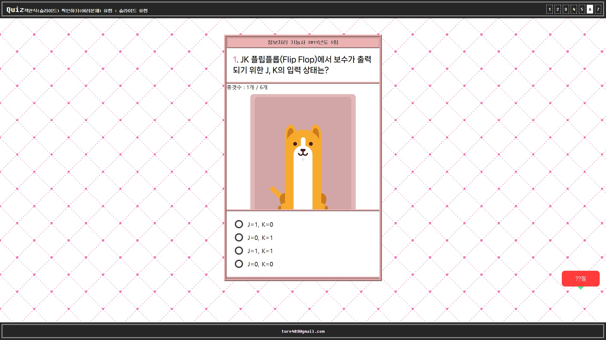

# JS-quiz

자바스크립트로 작성한 퀴드 이펙트 입니다. 

******

📓 사용 스택 및 함수(메서드)
---

➡️ HTML: 웹 페이지의 구조를 정의하는 데 사용됩니다.  
➡️ CSS : 웹 페이지와 애플리케이션의 시각적 디자인과 레이아웃을 제어하여 사용자 경험을 향상시키는 스타일링 언어입니다   
➡️ javascript : 
+ setInterval : JavaScript에서 제공하는 함수로, 일정한 시간 간격으로 지정한 함수를 주기적으로 실행하는 타이머를 설정하는 역할을 합니다.
+ forEach():  JavaScript의 배열 메서드 중 하나로, 배열의 각 요소마다 지정된 함수를 한 번씩 실행하는 역할을 합니다. 이를 통해 배열의 요소들을 반복하면서 각 요소에 대해 특정 동작을 수행할 수 있습니다.
+ fetch :  기본적으로 Promise를 반환하며, 비동기적으로 데이터를 처리할 수 있도록 해줍니다.
+ map(): 배열의 각 요소에 대해 지정한 콜백 함수를 순차적으로 실행하며, 각 요소에 대해 반환된 값을 새로운 배열에 모아 반환합니다. 원본 배열을 변경하지 않고 새로운 배열을 생성합니다.
+ push(): 배열의 끝에 하나 이상의 요소를 추가하는 역할을 합니다. 이를 통해 배열에 새로운 요소를 넣을 수 있습니다.
+ join(): JavaScript 배열의 메서드 중 하나로, 배열의 모든 요소를 문자열로 합치는 역할을 합니다. 이를 통해 배열의 요소들을 하나의 문자열로 합칠 수 있습니다.
+ Math.random():  JavaScript의 Math 객체에서 제공하는 메서드 중 하나로, 0 이상 1 미만의 난수(랜덤한 수)를 생성하는 역할을 합니다. 이 메서드를 호출할 때마다 새로운 무작위 숫자가 반환됩니다.
+ Math.ceil(): JavaScript의 Math 객체에서 제공하는 메서드 중 하나로, 주어진 숫자를 올림하여 가장 가까운 정수를 반환하는 역할을 합니다.

# 프로젝트 목적

---

📕  setInterval 이해  
📕  forEach 이해  
📕  fetch 이해  
📕  map 이해  
📕  push 이해  
📕  join 이해  
📕  Math.random 이해  
📕  Math.ceil 이해  

